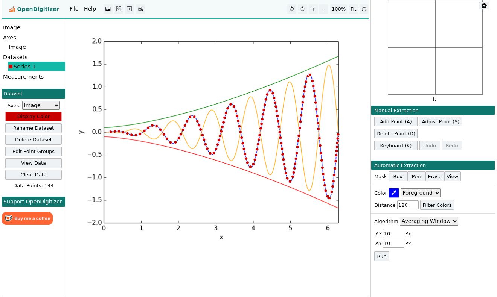
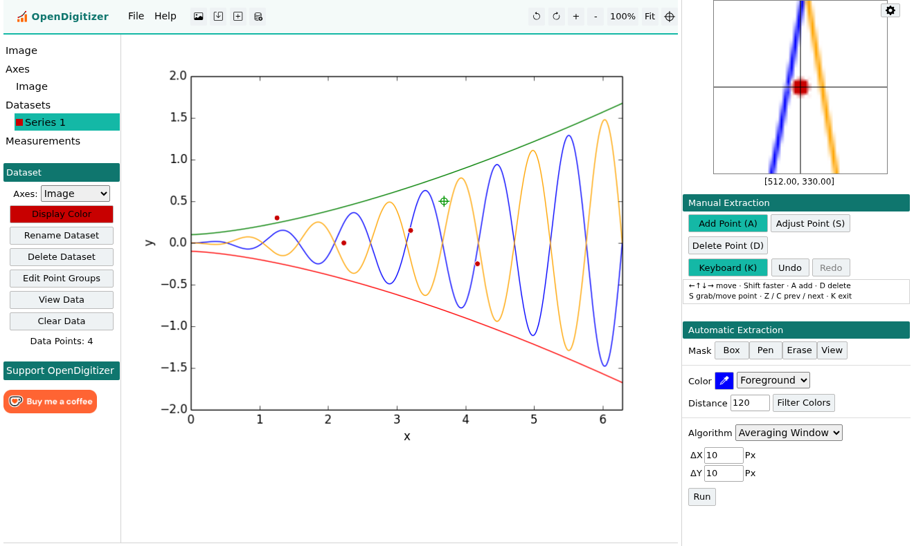

# OpenDigitizer

**OpenDigitizer** is a browser-based tool for extracting numerical data from
images of charts and plots — with an **open, pluggable computer-vision / AI
extraction layer** and a **keyboard-first digitizing workflow**.



*Above: OpenDigitizer auto-extracting a curve (red points) from a plot image.*

> Open fork of [WebPlotDigitizer](https://github.com/automeris-io/WebPlotDigitizer) by Ankit Rohatgi.
> Distributed under **AGPL-3.0**. Independent project — not affiliated with or endorsed by Automeris LLC.

---

## Highlights

- **Open CV/AI extraction seam.** New detectors register themselves and show up in
  the *Automatic Extraction → Algorithm* dropdown. Run detection in **pure JS**,
  **in-browser WASM** (e.g. ONNX Runtime / TensorFlow.js), or your **own remote
  Python service** — no closed cloud dependency. See
  [`docs/EXTENDING-CV-AI.md`](docs/EXTENDING-CV-AI.md).
- **Keyboard-first digitizing.** Press **`K`**, then: arrow keys move a crosshair
  (**Shift** = faster), **`A`** add, **`D`** delete, **`S`** grab & move a point,
  **`Z`/`C`** jump to the previous/next point. The magnifier and live coordinate
  readout follow the crosshair.
- **Multi-select & one-shot delete** with additive selection (Shift/Ctrl-click,
  Shift-drag), plus **point-level Undo/Redo** (`Ctrl+Z` / `Ctrl+Y`).
- **Folder / thumbnail browser.** Open a whole folder of images; hover a thumbnail
  for a large preview, click to switch.
- **Flexible masking.** Freehand **Pen/Erase**, a **keyboard brush** (`K`), and
  click-to-click **Polygon (PolyG)** fill and **Polyline (PolyL)** stroke masks,
  with numeric brush width.
- **Distinct OpenDigitizer theme.**

## Core capabilities

- Chart/axis types: **XY, polar, ternary, bar, map, image, circular chart recorder**.
- **Manual** and **automatic** (color-mask + algorithm) extraction.
- **Measurements**: distance, angle, area/perimeter.
- **Export**: CSV, clipboard, Plotly; **save/resume** projects.

## Keyboard placement mode



Toggle with **`K`** (or the sidebar button). The crosshair is the only cursor
while active (the mouse is disabled), so the whole workflow is keyboard-driven:

| Key | Action |
|---|---|
| ← ↑ ↓ → | move crosshair (hold **Shift** to move faster) |
| **A** | add a point at the crosshair |
| **D** | delete the point at the crosshair |
| **S** | grab the nearest point, then arrows move it (press **S** to release) |
| **Z** / **C** | jump to previous / next point |
| **K** | exit keyboard mode |

## Quick start

**No build (development):** serve the folder and open `dev.html`, which loads the
JavaScript directly.

```bash
python3 -m http.server 8080     # run from this folder
# open http://localhost:8080/dev.html
```

**Production build** (minified `wpd.min.js` + rendered HTML):

```bash
npm install
npm run build     # requires python3 with jinja2 + babel for HTML rendering
npm start         # host locally, then open index.html
```

**Docker:**

```bash
docker compose up --build       # install deps, build, and host on :8080
```

## Extending with your own CV / AI

Detectors implement a small interface and register with `wpd.detectorRegistry`;
they then appear alongside the built-in algorithms. The repo ships a worked
local-JS example ([`exampleColumnDetector.js`](javascript/core/curve_detection/exampleColumnDetector.js))
and a ready-to-use remote-HTTP adapter (`wpd.RemoteDetector`) with a reference
FastAPI server. Full contract and recipes (JS / WASM / Python):
[`docs/EXTENDING-CV-AI.md`](docs/EXTENDING-CV-AI.md).

## Contributing

Issues and pull requests are welcome. See
[`CHANGES-OpenDigitizer.md`](CHANGES-OpenDigitizer.md) for what this fork changed
relative to upstream, and [`CONTRIBUTING.md`](CONTRIBUTING.md) for guidelines.

## License

OpenDigitizer is distributed under the **GNU Affero General Public License v3.0**
([`LICENSE`](LICENSE)).

It is a fork of **WebPlotDigitizer**; original work © 2010–2025 Ankit Rohatgi /
Automeris LLC. All original copyright and license notices are retained.
