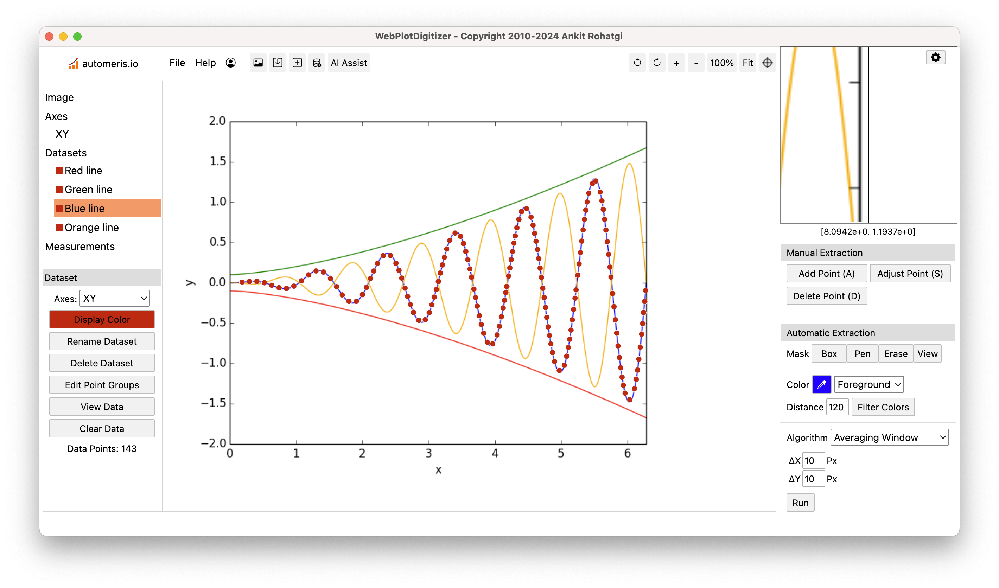

# OpenDigitizer

**OpenDigitizer is an open fork of [WebPlotDigitizer](https://github.com/automeris-io/WebPlotDigitizer) (v5.3.0) by Ankit Rohatgi.**
It keeps the entire frontend open (AGPL-3.0) and adds an **open, pluggable
computer-vision / AI extraction layer** plus several manual-mode usability
improvements. It is not affiliated with or endorsed by Automeris LLC.

> Upstream WebPlotDigitizer's "AI Assist" is a closed cloud service. OpenDigitizer
> instead exposes a documented detector contract so anyone can plug in their own
> CV/AI — in pure JS, in-browser WASM, or a self-hosted Python service. See
> [`docs/EXTENDING-CV-AI.md`](docs/EXTENDING-CV-AI.md).

## What this fork adds

- **Multiple selection & deletion (manual mode).** The *Adjust* tool now deletes
  *all* selected points at once (tuple/point-group safe), and supports
  additive/toggle selection with Shift/Ctrl-click and Shift-drag.
- **Point-level Undo / Redo.** Snapshot-based undo for add/delete/clear, via
  Ctrl/Cmd+Z and Ctrl/Cmd+Y (or the new sidebar buttons). Upstream only had undo
  for image crop.
- **Keyboard placement mode (`K`).** Toggle with the `K` key or the sidebar
  button: move a crosshair with the arrow keys (Shift = faster), press **`A`** to
  add a point at the crosshair, and jump between existing points with **`Z`**
  (previous) / **`C`** (next). The magnified view and live coordinate readout
  follow the crosshair.
- **Folder / thumbnail browser.** "Open Folder" loads every image in a folder as
  a multi-file session and shows a thumbnail strip; hovering a thumbnail shows a
  large preview, clicking switches to it.
- **Pluggable detector registry (`wpd.detectorRegistry`).** New CV/AI detectors
  register themselves and appear in the *Automatic Extraction → Algorithm*
  dropdown next to the built-ins. Ships with a worked JS example
  (`exampleColumnDetector.js`) and a ready-to-use remote-HTTP adapter
  (`wpd.RemoteDetector`) for Python backends.

### Quick start (no build needed)

Open `dev.html` in a browser — it loads the individual JS files directly. For a
production/minified page, run `npm install && npm run build` and open `index.html`.

See [`CHANGES-OpenDigitizer.md`](CHANGES-OpenDigitizer.md) for the full list of
files touched.

---

## Upstream WebPlotDigitizer

A large quantity of useful data is locked away in images of data visualizations. WebPlotDigitizer is a computer vision assisted software that helps extract numerical data from images of a variety of data visualizations.

WPD has been used by thousands in academia and industry since its creation in 2010 (Google Scholar Citations)

To use WPD, sign-up on https://automeris.io



## Donate

Donatations help keeping WPD free for thousands of scientists and researchers across the world.

<a href='https://ko-fi.com/L4L010CWIY' target='_blank'></a>

## Documentation

Visit: https://automeris.io/docs/

## License

WPD frontend is distributed under GNU AGPL v3 license (this repository). 

Automeris "AI Assist" and other related cloud based systems are closed source and owned by Automeris LLC (owned by Ankit Rohatgi).

## Contact

Primary Author and Maintainer: Ankit Rohatgi

Email: plots@automeris.io

## Contributions

WPD does not have an official roadmap. Please consult before submitting contributions.


## Local build (for development)

With Docker:
```
docker compose up --build               # install depedencies, build and host
docker compose run wpd npm run build    # rebuild
docker compose run wpd npm run format   # autoformat code
http://localhost:8080/tests             # run tests
```

Without Docker:
```
npm install     # install dependencies
npm run build   # build artifacts
npm start       # host locally
npm run format  # autoformat code
npm run test    # run tests
```
